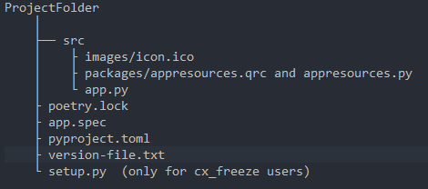

## Icon Applicattion and taskbar Icon, PySide2 Project.

## Single exe file with PyInstaller and cx_Freeze.

Already getting frustrated, after several times trying to create an exe file with pyinstaller, with icon in the application and in the windows task bar, I decided to use cx_Freeze thinking it was a PyInstaller bug. Using cx_Freeze the result failed again. So the problem was not in the PyInstaller. The solution was to use a compiled icon file. 

With this I got PyInstaller and cxFreeze working !

#### More information here:

[The Qt Resource System | Qt Core 5.15.13](https://doc.qt.io/qt-5/resources.html)

[Using Spec Files — PyInstaller 5.10.1 documentation](https://pyinstaller.org/en/stable/spec-files.html)

[cx_Freeze 6.15.0-dev3 documentation (cx-freeze.readthedocs.io)](https://cx-freeze.readthedocs.io/en/latest/index.html)

#### Same works with cx_Freeze. (tested)

---

###### Ecosystem python global:

* pyenv global 3.9.12
* pipx
* poetry  (installed with pipx command: python -m pipx install poetry)

---

###### Project virtualenv:

* pyenv local 3.9.8
* pyinstaller 	(preferred for me, because pyinstaller create an binary exe file not an installer)
* cx-freeze 	(read introdution because I also used cx_Freeze, but it was not necessary)
* PySide2

---

###### Project folder structure:



---

###### setup.py  (only for cx_freeze compiler)

```
import sys
from cx_Freeze import setup, Executable

# base="Win32GUI" should be used only for Windows GUI app
base = "Win32GUI" if sys.platform == "win32" else None

# Dependencies are automatically detected, but it might need fine tuning.
build_exe_options = {
    "excludes": ["tkinter", "unittest"],
    "zip_include_packages": ["encodings", "PySide2", "PIL", "qdarkstyle"],
}

setup(
    name="png2ico",
    version="0.1.0",
    description="My GUI application!",
    options={
        "build_exe": build_exe_options,
  },
    executables=[Executable("src/app.py", base=base)],
)

```

---

###### app.spec (only for pyinstaller compiler)

```
# -*- mode: python ; coding: utf-8 -*-

import PyInstaller.config

PyInstaller.config.CONF['workpath'] = 'ProjectFolder/build'
PyInstaller.config.CONF['distpath'] = 'ProjectFolder/dist'

block_cipher = None

a = Analysis(['ProjectFolder/src/app.py'],
             pathex=['ProjectFolder', ],
             binaries=[],
             datas=[],
             hiddenimports=['PySide2', 'PIL', 'qdarkstyle', 'encodings', 'pkg_resources'],
             hookspath=[],
             runtime_hooks=[],
             excludes=['tkinter', 'unittest', 'http', 'pydoc', 'pdb'],
             win_no_prefer_redirects=False,
             win_private_assemblies=False,
             cipher=block_cipher,
             noarchive=False)
pyz = PYZ(a.pure, a.zipped_data,
             cipher=block_cipher)
exe = EXE(pyz,
          a.scripts,
          a.binaries,
          a.zipfiles,
          a.datas,
          [],
          name='png_to_ico',
          debug=False,
          bootloader_ignore_signals=False,
          strip=False,
          upx=True,
          upx_exclude=[],
          runtime_tmpdir=None,
          console=False,
          icon='src/images/icon.ico',
          version='version-file.txt')
```

---

###### appresources.qrc

```
<!DOCTYPE RCC><RCC version="1.0">
<qresource>
    <file>images/icon.ico</file>
</qresource>
</RCC>
```

---

###### Add this lines to app.py

```
from packages import ui_Form, appresources
.
.
.
class Form(QMainWindow, ui_Form.Ui_MainWindow):

    def __init__(self):
        super(Form, self).__init__()
        self.setupUi(self)
	self.setWindowIcon(QIcon(QPixmap(":/images/icon.ico")))  # important adapt this folder name ":/images/" to your project
.
.
.
```

---

## Create single one exe file.

* Compile resources file
  `pyside2-rcc -g python src/packages/appresources.qrc > src/packages/appresources.py`
* Make exe file
  `pyinstaller app.spec`
* for cx_Freeze users (Note: cx_freeze not create single exe file, cx_freeze create an msi installer package with all files needed)
  `python -m setup.py bdist_msi`

---

I hope this will help you and avoid wasted time.  Good code and be happy !
